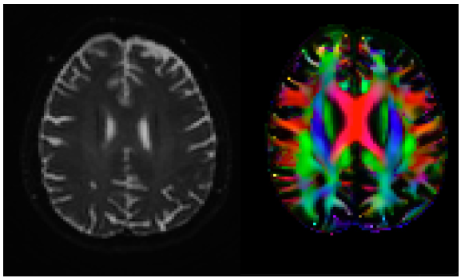

# **DTI Processing Pipeline**

This repository serves as a collection of code, scripts, and notes for DTI processing, constituting a pipeline that can take an dMRI DICOM  all the way to beautifully pre-processed DTI images (and beyond). 

## Contents Contained in this repo (running list):

### (1) DTI Processing Pipeline Jupyter Notebook 
- For DTI processing of NIFTI files: 
- Run from Jupyter Notebook and change base path directory to your own.  
- Required Starting files: bval.bval, bvec.bvec, dti.nii files are in each patient folder.

### (2) MIRTK Registration 
- Run from command line

